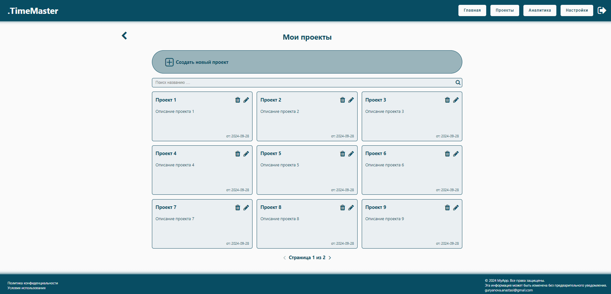
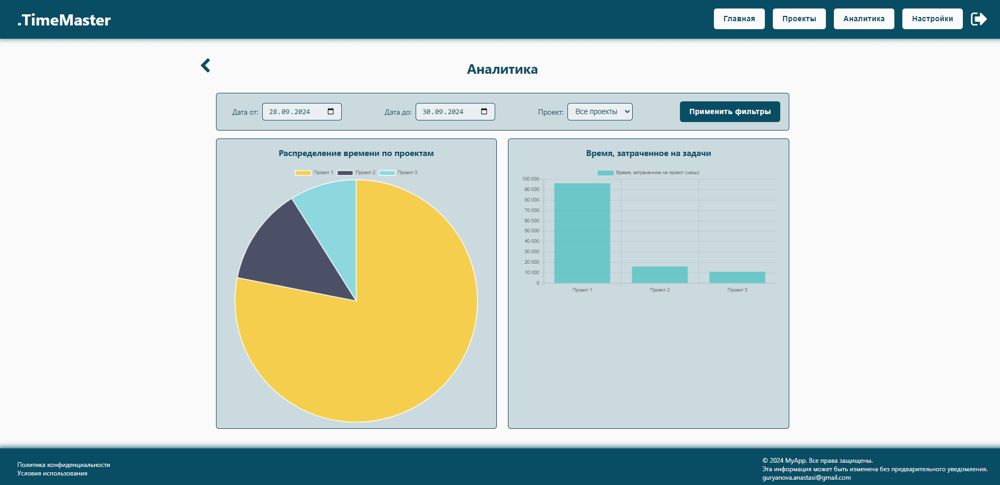
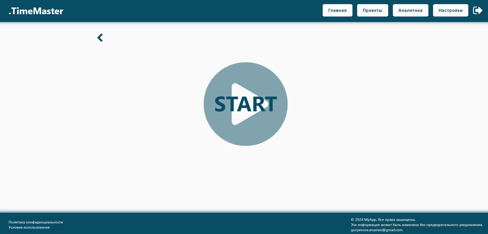
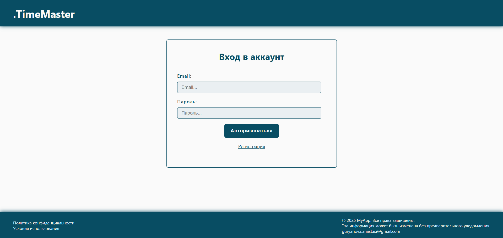

# Приложение для управления проектами и отслеживания времени

Full-stack приложение для управления проектами, отслеживания задач и анализа времени, затраченного на работу.

## О проекте

Это полнофункциональное веб-приложение для управления проектами и отслеживания времени, затраченного на задачи. Пользователи могут создавать и редактировать проекты, запускать таймер для задач, отслеживать прогресс и анализировать данные с помощью графиков.

## Цель:

Упростить управление проектами и предоставить аналитику для повышения продуктивности.

## Технологии

-   **Frontend:** React, Redux, React Router, Styled Components, Chart.js
-   **Backend:** Node.js, Express.js, MongoDB
-   **Деплой:** Docker, размещение на сервере
-   **Инструменты:** Vite, ESLint, Prettier, Git

## Требования

-   Node.js (v16 или выше)
-   MongoDB (локальная или облачная версия)
-   Docker (опционально, для контейнеризации)

## Скриншоты

| Панель проектов                          | Страница аналитики                      | Таймер задач                     | Страница авторизации                          |
| ---------------------------------------- | --------------------------------------- | -------------------------------- | --------------------------------------------- |
|  |  |  |  |
